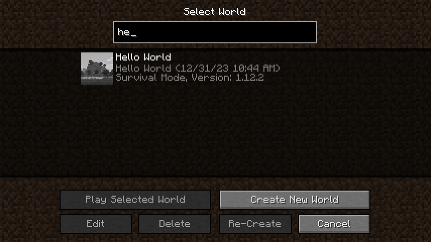
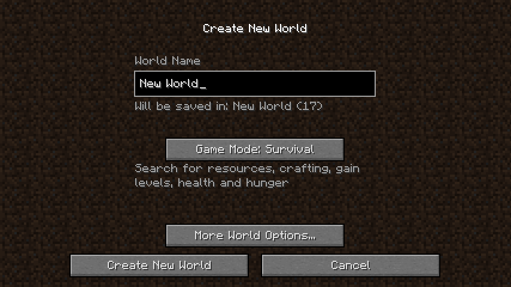
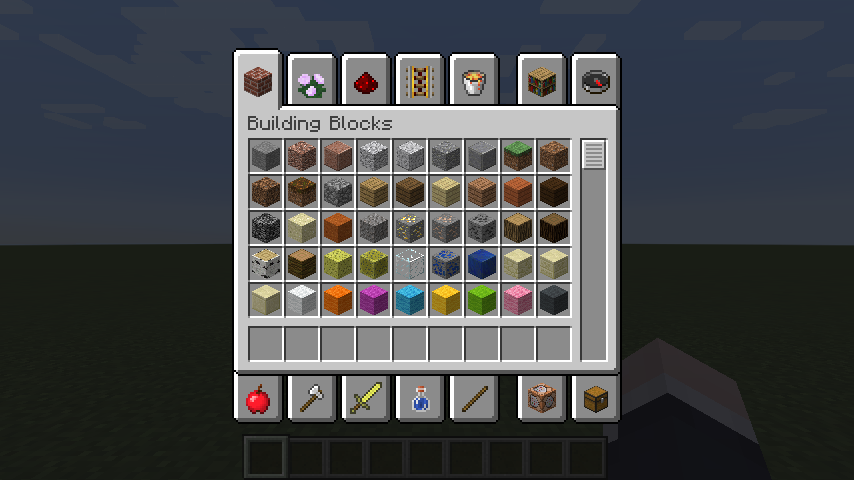
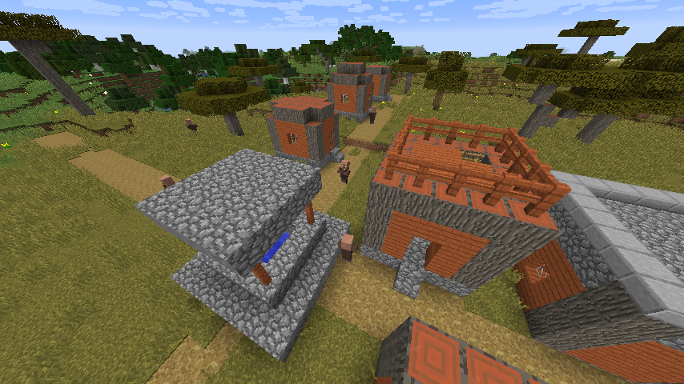

# ReFound for 1.12.2

ReFound provides several minor enhancements to Minecraft 1.12.2. ReFound serves as a dependency for [ReWind](https://github.com/re-1122/rewind) and [ReFlect](https://github.com/re-1122/reflect).

ReFound is a part of [Re:1.12.2](https://github.com/re-1122) project.

## Features

- World search (ported from 1.13+)
  
- Duplicate world name resolution by a number (ported from 1.14+)
  
- Revamped creative inventory (ported from 1.19.3+)
  
- Revamped savanna village generation 
  
- Turning off snooper setting automatically
- Highly configurable; you can turn off any feature you don't like

## License

Mozilla Public License 2.0