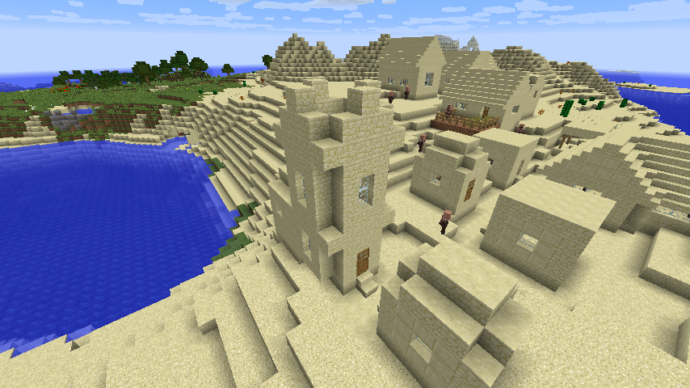

# ReFound for 1.12.2

ReFound provides several minor enhancements to Minecraft 1.12.2. ReFound serves as a dependency for [ReWind](https://github.com/re-1122/rewind) and [ReFlect](https://github.com/re-1122/reflect).

ReFound is a part of [Re:1.12.2](https://github.com/re-1122) project.

## Features

- World search (ported from 1.13+)
  
- Duplicate world name resolution by a number (ported from 1.14+)
  
- Revamped creative inventory (ported from 1.19.3+)
  
- Village generation fix
  
- Turning off snooper setting automatically
- Highly configurable; you can turn off any feature you don't like

## Installation

1. Install [Minecraft Forge](https://files.minecraftforge.net/) for 1.12.2.
2. Download [ReFound](https://github.com/re-1122/refound/releases) and put it into your mods folder.
3. Launch the game.
4. Enjoy!

## License

ReFound is licensed under Mozilla Public License 2.0.